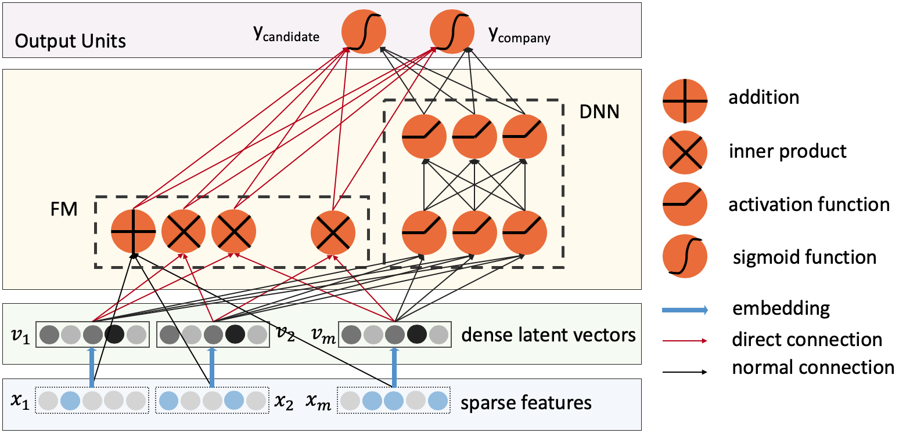

# biDeepFM
Implementation of the paper: [biDeepFM: A multi-objective deep factorization machine for reciprocal recommendation](https://www.sciencedirect.com/science/article/pii/S2215098621000744).

## Architecture



## Note
For the implementation of multi-objective models used in the research, [DeepCTR](https://github.com/shenweichen/deepctr) package has been used. All multi-objective models have been added to this package and given under `architectures` directory in this repository.


## Citation

- Yıldırım, Ezgi, Payam Azad, and Şule Gündüz Öğüdücü. "biDeepFM: A multi-objective deep factorization machine for reciprocal recommendation." Engineering Science and Technology, an International Journal (2021).


If you find this code useful in your research, please cite it using the following BibTeX:

```bibtex
@article{yildirim2021bideepfm,
  title={biDeepFM: A multi-objective deep factorization machine for reciprocal recommendation},
  author={Y{\i}ld{\i}r{\i}m, Ezgi and Azad, Payam and {\"O}{\u{g}}{\"u}d{\"u}c{\"u}, {\c{S}}ule G{\"u}nd{\"u}z},
  journal={Engineering Science and Technology, an International Journal},
  year={2021},
  publisher={Elsevier}
}
```
